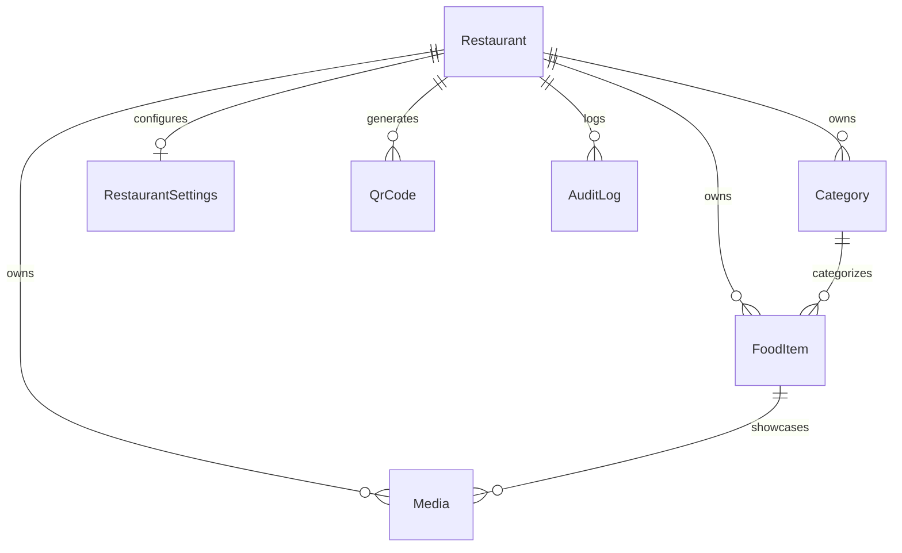

# Database Architecture & Operations Guide

## Overview

The Interactive Visual Restaurant Menu platform uses **PostgreSQL** as the authoritative single source of truth for all business entities:
- **Restaurants** (tenants)
- **Categories**
- **FoodItems** (with `Decimal(10,2)` monetary values and soft deletion)
- **Media** (metadata references to external/cloud or static assets)
- **RestaurantSettings**
- **QrCode**
- **AuditLog** (operational changes)
- **Extensible models**: Tables, Orders, OrderItems, Customers, Users, Translations

---

## 1. Environment & Configuration

Database connection settings are specified via `DATABASE_URL` in the root `.env` file (copied from `.env.example`).

```bash
DATABASE_URL="postgresql://postgres@127.0.0.1:5433/restaurant_menu?schema=public"
PORT=3001
NODE_ENV=development
```

> [!IMPORTANT]
> Never commit `.env` or production credentials to source control. Use `.env.example` as a template for staging and production environments.

---

## 2. Entity-Relationship & Schema Design

### Core Models



### Safety & Integrity Highlights
1. **UUID Primary Keys**: All entities use `@id @default(uuid()) @db.Uuid` to prevent enumeration attacks and support distributed generation.
2. **Decimal Monetary Values**: `FoodItem.price` is defined as `@db.Decimal(10, 2)` to eliminate floating-point precision errors in financial calculations.
3. **Multi-Tenant Isolation**: Every tenant entity has a foreign key to `Restaurant(id)` (`onDelete: Cascade` where appropriate). Cross-tenant validation is strictly enforced at the API controller layer.
4. **Soft Deletion**: `FoodItem.deletedAt` (`DateTime?`) enables non-destructive removals. Active items query `WHERE deletedAt IS NULL`.
5. **Safe Category Deletion**: Categories cannot be deleted if active food items are associated with them; they must first be reassigned or archived.
6. **Optimized Indexes**:
   - `Restaurant.slug` (`UNIQUE`)
   - `Category`: `[restaurantId, displayOrder]`, `[restaurantId, slug]`
   - `FoodItem`: `[restaurantId, categoryId]`, `[restaurantId, available]`, `[restaurantId, displayOrder]`, `[deletedAt]`
   - `Media`: `[restaurantId, foodItemId]`
   - `QrCode`: `[restaurantId, tableNumber]`
   - `AuditLog`: `[restaurantId, entityType, createdAt]`

---

## 3. Development Workflow

### Prerequisites
- Node.js >= 18
- PostgreSQL >= 15

### Initial Setup
```bash
# 1. Install dependencies
npm install

# 2. Copy environment file
cp .env.example .env

# 3. Generate Prisma Client
npx prisma generate

# 4. Run migrations in development
npx prisma migrate dev --name init

# 5. Seed the database with deterministic demo data
npm run db:seed
```

### Useful CLI Commands
- `npm run db:generate`: Regenerate the Prisma client after editing `prisma/schema.prisma`.
- `npm run db:migrate`: Create and execute incremental migrations against the local development database.
- `npm run db:seed`: Execute the idempotent seed script (`prisma/seed.ts`).
- `npm run test:api`: Execute the full Jest integration test suite against the live database and API endpoints.

---

## 4. Production Deployment & Migrations

For production environments (CI/CD pipelines, containerized deployments, or cloud VMs):

### Migration Execution
Do **NOT** use `prisma migrate dev` in production. Instead, run:
```bash
npx prisma migrate deploy
```
`prisma migrate deploy` executes pending migrations recorded in `prisma/migrations` without creating new migrations or resetting the database.

### Zero-Downtime Migration Guidelines
1. **Additive Schema Changes**: Always add new columns as nullable or with a default value before modifying application code.
2. **Deprecation Phase**: Run both old and new code versions simultaneously if rolling updates are used.
3. **Column Drops / Renames**: Split into two separate deployments: first stop using the column, then drop it in a subsequent migration.

---

## 5. Backup & Recovery Recommendations

### Recommended Backup Strategy
- **Automated Daily Backups**: Schedule automated snapshot backups via cloud provider (AWS RDS, GCP Cloud SQL, Supabase, Neon) or cron job.
- **Point-in-Time Recovery (PITR)**: Enable WAL (Write-Ahead Logging) archiving for critical production deployments to allow recovery to any minute within a retention window (typically 7–30 days).

### Manual Backup (pg_dump)
```bash
# Create compressed custom-format backup
pg_dump -h <HOST> -p <PORT> -U <USER> -F c -b -v -f "restaurant_menu_$(date +%Y%m%d_%H%M%S).dump" <DB_NAME>

# Plain SQL text format
pg_dump -h <HOST> -p <PORT> -U <USER> -F p -v -f "restaurant_menu_backup.sql" <DB_NAME>
```

### Restoration (pg_restore)
```bash
# Restore custom-format dump into target database
pg_restore -h <HOST> -p <PORT> -U <USER> -d <DB_NAME> -v "restaurant_menu_20260907_120000.dump"
```

---

## 6. Audit Logging

All administrative modifications (`CREATE`, `UPDATE`, `DELETE`) on core entities (`Restaurant`, `Category`, `FoodItem`, `Media`, `QrCode`, `RestaurantSettings`) automatically record an entry in the `AuditLog` table:
- `restaurantId`
- `entityType`
- `entityId`
- `action` (`CREATE` | `UPDATE` | `DELETE`)
- `changes` (JSON object of updated fields or snapshots)
- `performedBy` (user identity or demo identifier)
- `createdAt` (UTC timestamp)
